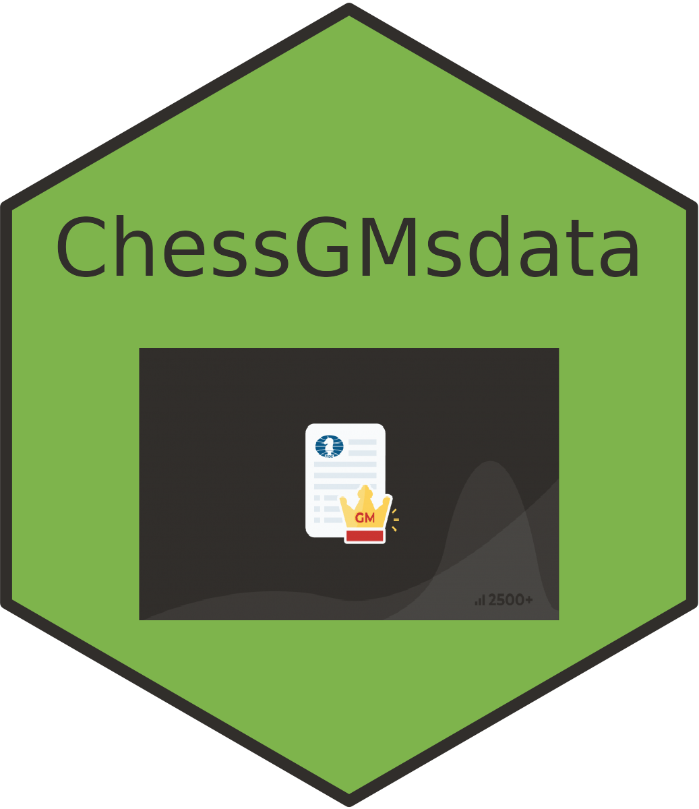

<h3 align="center">ChessGMsdata</h3>

<h4>

  Chess Grand Masters Data. 
  <br><br>
  &middot;
  by <a href="https://www.linkedin.com/in/aswanijehangeer/">Jehangeer Aswani</a>
</h4>


[](https://github.com/aswanijehangeer/ChessGMsdata/issues)

---

A comprehensive R data package containing a dataset of chess grandmasters' information, including their personal details, achievements, and more. This package serves as a valuable resource for chess analysis, research, and exploration of the chess world.
<br>
<br>

## Installation

You can install this package from GitHub using the `devtools` package:

```R
# Install devtools if not already installed
if (!requireNamespace("devtools", quietly = TRUE)) {
  install.packages("devtools")
}

# Install ChessGMsdata from GitHub
devtools::install_github("aswanijehangeer/ChessGMsdata")
```

## Usage

To load the dataset, simply use:

```R
# loading package
library(ChessGMsdata)

# data
data(chess_grandmasters)
```

This will make the chess_grandmasters dataset available for your analysis.

## License

This package is open-source and available under the [MIT License](LICENSE).

## Contact

For questions, issues, or suggestions, please open an issue.

-
